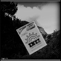
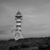

<p align="center">
  <a href="https://codely.com">
    
  </a>
</p>

<h1 align="center">
 📸🌊 Haar Cascade - OpenCV en Linux - Python
</h1>

En este repositorio se encuentra el codigo y los pasos necesario para generar tu archivo `cascade.xml` o entrenar el reconocimiento de imagenes con la técnica **Haar Cascade** a travez de la linea de comandos en linux, y luego hacer la prueba de entrenamiento con Python, una camara y el obejto en movimiento, en este caso se uso una caja de fosforo 😅

<p align="center">

</p>

Para poder entrenar por **Haar Cascade** con **OpenCV** necsitaremos hacer los siguientes pasos:  

# Tabla de contenido

- [Instalar OpenCV en Linux](#instalar-opencv-en-linux)
- [Imagenes positivas y negativas](#Imagenes-positivas-y-negativas)
- [Entrenar nuestro Haar Cascade](#Entrenar-nuestro-Haar-Cascade)
- [Licencia](#Licencia)


## Instalar OpenCV en Linux

Para instalar en linux. para distrubuciones basadas en debian se puede hacer de 2 maneras, instalar desde e los repositorios la herramienta ya compilada o compilarla desde el repositorio github de OpenCV

**Para compilar e instalar desde el repositorio de github correr los comandos:**

- Aseguramos de actualizar nuestro equipo

  ```sh
  sudo apt-get update
  sudo apt-get upgrade
  ```
- Descargamos las herramientas de compilacion necesarias:

  ```sh
  # Compiler: 
  sudo apt-get install build-essential
  # Libraries: 
  sudo apt-get install cmake git libgtk2.0-dev pkg-config libavcodec-dev libavformat-dev libswscale-dev
  # Python
  Python bindings and such: sudo apt-get install python-dev python-numpy libtbb2 libtbb-dev libjpeg-dev libpng-dev libtiff-dev libjasper-dev libdc1394-22-dev
  ```
  luego seguiremos los pasos comunes para instalar con make en linux como se muestra en el siguiente enlace

  [Compilar OpenCv - Make](https://gist.github.com/Mahedi-61/804a663b449e4cdb31b5fea96bb9d561)

**Para instalar desde los repos del OS Linux correr los comandos:**
- Basta ejecutar el siguiente comando
```sh
sudo apt-get install libopencv-dev
```

- Luego tener instalado obviamente Python
```sh
# Python
  Python bindings and such: sudo apt-get install python-dev python-numpy libtbb2 libtbb-dev libjpeg-dev libpng-dev libtiff-dev libjasper-dev libdc1394-22-dev
```

## Imagenes positivas y negativas

Para poder entregar nuestro reconocedor necesitamos muchas imagenes positivas y negativas, las **positivas** son imgenes con el objeto en cuestión, y las **negativas** son cualquier imagen donde no se encuentre el objeto.

### Crear imagenes negativas

- Descargar unas 2000 imagenes de paisajes de un Repositorio como [Kaggkle](kaggle.com)

- Esta url de [imagenes - paisajes](https://www.kaggle.com/datasets/theblackmamba31/landscape-image-colorization) nos servira, asi que vamos a descargar y descomprimmir en nuestra carpeta `./fondos`:  

  ***Ejemplo***  


  por cierto hay mas de 2000 imagenes en esa url, asi que borra hasta quedarte solo con 2000 imagenes

- Luego con el siguiente codigo vamos redimensionar a 100px  de ancho y largo a todas las imagenes y ponerlo en escala de grises (ya que asi funciona opencv con grises); esas seran nuestras imagenes **negativas** y con el mismo codigo las pondra en la carpeta `./neg`:

  Archivo `./generate-images.py`:

  ```python
  import cv2
  import numpy as np
  import os

  def generate_images_neg():
      pic_num = 1
      
      if not os.path.exists('neg'):
          os.makedirs('neg')
          
      for file_type in ['fondos']:
          for img in os.listdir(file_type):
              try:
                  print(img)
                  img = cv2.imread("fondos/"+str(img), cv2.IMREAD_GRAYSCALE)
                  resized_image = cv2.resize(img, (100, 100))
                  cv2.imwrite("neg/"+str(pic_num)+".jpg",resized_image)
                  pic_num += 1
                  
              except Exception as e:
                  print(str(e))  

  generate_images_neg()
  ```

  Ejecutamos de la siguiente forma:
  ```sh
    python3 generate-images.py
  ```

  Al finalizar el comando obtendremos los 2000 imagenes **negativas** como el siguiente ***ejemplo** :  
  


### Crear imagenes positivas

- Tener una sola imagen del objeto que queremos reconocer, tiene que ser pequeña en este caso es de `60px * 83px`, si puede ser mas pequeña genial, de otro modo tomara demasiado tiempo el entrenamiento.  


- Con ayuda de python pondremos nuestra objeto en las 2000 imagenes **negativas** de paisajes con rataciones de 0.5 y alejamientos de 0.5 tambien con el siguiente comando:

```sh
opencv_createsamples -img pos/fosforo-60-83.jpg -bg bg.txt -info info/info.lst -pngoutput info -maxxangle 0.5 -maxyangle 0.5 -maxzangle 0.5 -num 2000

# la salida sera:
Info file name: info/info.lst
Img file name: fosforo-60-83.jpg
Vec file name: (NULL)
BG  file name: bg.txt
Num: 2000
BG color: 0
BG threshold: 80
Invert: FALSE
Max intensity deviation: 40
Max x angle: 0.5
Max y angle: 0.5
Max z angle: 0.5
Show samples: FALSE
Width: 24
Height: 24
Max Scale: -1
Create test samples from single image applying distortions...
Done
```

Este comando tambien generar un archivo `info/info.lst` donde indica nombre de la imagen nueva y la ubicacion del objeto en ésta.

Aqui unos pares de imagenes de ejemplos que se generaron con el anterior codigo:  




  

Luego ejecutar el siguiente comando que nos servira para decirle a opencv donde encontrar nuestas imagenes **positivas**

```sh
opencv_createsamples -info info/info.lst -num 2000 -w 20 -h 20 -vec positives.vec

# la salida sera un archivo
./positives.vec
```

## Entrenar nuestro Haar Cascade

Para entrenar nuestro Haar cascade se tiene que tener en cuenta lo siguiente:
- cuantas imagenes positivas 
- cuantas imagenes negativas
- la informacion de donde se encuentra las negativas `./bg.txt`
- Cuantas etapas de entrenamiento hara `19` (duro aprox 1hora y 30 min)
- informacion de las imagenes positivas `./positives.vec`

antes de ejecutar, borra todo el contenido de `./data/`.

```sh
opencv_traincascade -data data -vec positives.vec -bg bg.txt -numPos 1800 -numNeg 900 -numStages 19 -w 20 -h 20 
```

Con todo esto, se agregara a nuesta carpeta `./data` las etapas en formato xml y el famoso `cascade.xml`, que lo renombramos para este caso como: `./cascade-fosforo-60-83-19-stage.xml` y lo pusimos en la raiz del proyecto. 

Para ver el funcionamiento solo ejecuta el siguiente codigo:

```python
import numpy as np
import cv2

#this is the cascade we just made. Call what you want
cascade = cv2.CascadeClassifier('./cascade-fosforo-60-83-19-stage.xml')

cap = cv2.VideoCapture(0)

while 1:
    ret, img = cap.read()
    gray = cv2.cvtColor(img, cv2.COLOR_BGR2GRAY)
    
    # add this
    # image, reject levels level weights.
    fosforo = cascade.detectMultiScale(gray, 1.2, 3)
    
    # add this
    for (x,y,w,h) in fosforo:
        font = cv2.FONT_HERSHEY_SIMPLEX
        # cv2.putText(img,'Fosforo',(x-w,y-h), font, 0.5, (11,255,255), 2, cv2.LINE_AA)
        cv2.putText(img,'Fosforo',(x,y-10),2,0.7,(0,255,0),2,cv2.LINE_AA)
        cv2.rectangle(img,(x,y),(x+w,y+h),(255,255,0),2)


    cv2.imshow('img',img)
    k = cv2.waitKey(30) & 0xff
    if k == 27:
        break

cap.release()
cv2.destroyAllWindows()
```

De la siguiente forma:
```sh
py detect-image.py
```


Y finalmente sosten tu fosforo 🔥 frente a la camara de tu laptop 📷  y tachan! 😄


<p align="center">

</p>

## Licencia

MIT

**Free Software, Hell Yeah!**